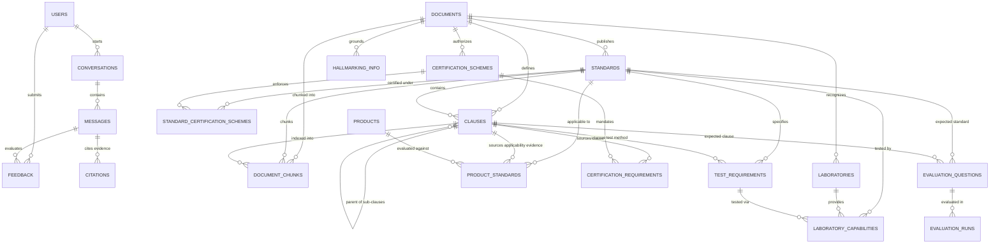

# Database Schema Documentation — BIS Copilot (Phase 1)

## 1. Overview & Architecture

**Project**: BIS Copilot — AI-powered Intelligent Assistant for Indian Standards and BIS Services  
**Problem Statement**: SIH 26107  
**Database Stack**:
- **RDBMS**: PostgreSQL 16 (via Docker container `pgvector/pgvector:pg16`)
- **Vector Extension**: `pgvector` (HNSW indexing with cosine similarity)
- **ORM**: SQLAlchemy 2.x (asyncpg for FastAPI, psycopg2 for migrations/CLI)
- **Migrations**: Alembic with model autodiscovery and extension management
- **Primary Keys**: Native UUIDv4 (`gen_random_uuid()`)
- **Timestamps**: Timezone-aware UTC (`TIMESTAMP WITH TIME ZONE`)
- **JSON Support**: PostgreSQL `JSONB` for unstructured attributes & retrieved chunk evaluations
- **Full-Text Search**: PostgreSQL `tsvector` with `GIN` indexing

The database is purpose-built to enforce strict **evidence-grounded traceability**:
```text
SOURCE DOCUMENT
      ↓
STANDARD
      ↓
CLAUSE (Hierarchical)
      ↓
DOCUMENT CHUNK (Embedding + TSVector)
      ↓
CITATION
      ↓
AI ASSISTANT RESPONSE
```

---

## 2. Entity-Relationship (ER) Diagram



---

## 3. Detailed Table Specifications

### 3.1 Users (`users`)
Stores platform consumers, industrial representatives, and administrators.
- `id` (UUID, PK): Primary key, default `gen_random_uuid()`.
- `name` (VARCHAR(255), NOT NULL): Full display name.
- `email` (VARCHAR(255), UNIQUE, NOT NULL): Indexed user email.
- `password_hash` (VARCHAR(255), NOT NULL): Secure hashed password.
- `role` (VARCHAR(50), NOT NULL, default `'user'`): Enforced check constraint `role IN ('user', 'admin')`.
- `preferred_language` (VARCHAR(10), NOT NULL, default `'en'`): Supported codes: `'en'`, `'hi'`, `'mr'`.
- `created_at`, `updated_at` (TIMESTAMP WITH TIME ZONE, NOT NULL).

### 3.2 Documents (`documents`)
Authoritative publications from BIS, government gazettes, and lab directories.
- `id` (UUID, PK): Unique document identifier.
- `title` (VARCHAR(500), NOT NULL): Document title.
- `document_type` (VARCHAR(50), NOT NULL): Enforced check constraint: `'standard'`, `'certification'`, `'hallmarking'`, `'laboratory'`, `'consumer'`, `'regulation'`, `'guideline'`, `'other'`.
- `source_name` (VARCHAR(255), NOT NULL): Source agency or department (e.g. `'BIS'`, `'Ministry of Consumer Affairs'`).
- `source_url` (TEXT, NULLABLE): Origin URL.
- `storage_url` (TEXT, NULLABLE): Internal object storage URL (e.g. S3 / GCS / local volume).
- `version` (VARCHAR(50), NOT NULL, default `'1.0'`).
- `publication_date` (DATE, NULLABLE).
- `effective_date` (DATE, NULLABLE).
- `status` (VARCHAR(50), NOT NULL, default `'active'`): Enforced check constraint: `'active'`, `'inactive'`, `'superseded'`, `'draft'`.
- `checksum` (VARCHAR(64), NULLABLE): SHA-256 hash to prevent duplicate ingestion.
- `created_at`, `updated_at` (TIMESTAMP WITH TIME ZONE, NOT NULL).

### 3.3 Standards (`standards`)
Specific Indian Standards (e.g., IS 1293:2019, IS 302-2-3).
- `id` (UUID, PK).
- `standard_number` (VARCHAR(100), UNIQUE, NOT NULL): e.g. `"IS 1293:2019"`.
- `title` (VARCHAR(500), NOT NULL): Official title.
- `short_title` (VARCHAR(255), NULLABLE).
- `scope` (TEXT, NULLABLE): Summary of applicability.
- `edition` (VARCHAR(50), NULLABLE).
- `publication_date` (DATE, NULLABLE).
- `status` (VARCHAR(50), NOT NULL, default `'active'`): `'active'`, `'withdrawn'`, `'superseded'`, `'draft'`.
- `document_id` (UUID, FK -> `documents.id`, ondelete=`RESTRICT`).
- `created_at`, `updated_at` (TIMESTAMP WITH TIME ZONE, NOT NULL).

### 3.4 Clauses (`clauses`)
Hierarchical provisions within standards.
- `id` (UUID, PK).
- `standard_id` (UUID, FK -> `standards.id`, ondelete=`CASCADE`).
- `document_id` (UUID, FK -> `documents.id`, ondelete=`RESTRICT`).
- `clause_number` (VARCHAR(50), NOT NULL): e.g. `"5"`, `"5.1"`, `"5.1.2"`.
- `heading` (VARCHAR(500), NULLABLE).
- `content` (TEXT, NOT NULL): Full text of the clause.
- `page_start` (INTEGER, NULLABLE), `page_end` (INTEGER, NULLABLE): Check constraint `page_end >= page_start`.
- `parent_clause_id` (UUID, FK -> `clauses.id`, ondelete=`RESTRICT`): Hierarchical tree relationship.
- `created_at` (TIMESTAMP WITH TIME ZONE, NOT NULL).
- **Composite Index**: `(standard_id, clause_number)`.

### 3.5 Document Chunks (`document_chunks`)
Core retrieval unit for hybrid RAG (vector + keyword + metadata).
- `id` (UUID, PK).
- `document_id` (UUID, FK -> `documents.id`, ondelete=`RESTRICT`).
- `standard_id` (UUID, FK -> `standards.id`, ondelete=`CASCADE`).
- `clause_id` (UUID, FK -> `clauses.id`, ondelete=`CASCADE`).
- `chunk_index` (INTEGER, NOT NULL, default `0`).
- `content` (TEXT, NOT NULL): Chunk text payload.
- `page_start`, `page_end` (INTEGER, NULLABLE).
- `metadata` (JSONB, NULLABLE): Section headers, language, source metadata.
- `embedding` (`VECTOR(EMBEDDING_DIMENSION)`): Configurable vector embedding (default: 1536).
- `search_vector` (`TSVECTOR`, NULLABLE): Full-text search tokens.
- `created_at` (TIMESTAMP WITH TIME ZONE, NOT NULL).

### 3.6 Products (`products`) & Product Standards (`product_standards`)
Product catalog and verified / model-generated mapping to Indian Standards.
- `products`:
  - `id` (UUID, PK).
  - `name` (VARCHAR(255), NOT NULL, indexed).
  - `category` (VARCHAR(100), NOT NULL, indexed).
  - `description` (TEXT, NULLABLE).
  - `attributes` (JSONB, NULLABLE): e.g. `{"voltage": "230V", "power": "1500W"}`.
  - `embedding` (`VECTOR(EMBEDDING_DIMENSION)`, NULLABLE).
- `product_standards`:
  - `id` (UUID, PK).
  - `product_id` (UUID, FK -> `products.id`, ondelete=`CASCADE`).
  - `standard_id` (UUID, FK -> `standards.id`, ondelete=`RESTRICT`).
  - `applicability` (VARCHAR(50), NOT NULL, default `'applicable'`): `'applicable'`, `'potentially_applicable'`, `'not_applicable'`, `'unknown'`.
  - `reasoning` (TEXT, NULLABLE).
  - `confidence` (FLOAT, NULLABLE): Check constraint `confidence >= 0.0 AND confidence <= 1.0`.
  - `source_clause_id` (UUID, FK -> `clauses.id`, ondelete=`SET NULL`).
  - **Unique Constraint**: `(product_id, standard_id)`.

### 3.7 Certification Schemes & Requirements
- `certification_schemes`:
  - `id` (UUID, PK).
  - `name` (VARCHAR(255), NOT NULL), `code` (VARCHAR(50), UNIQUE, NOT NULL).
  - `description` (TEXT, NULLABLE), `scope` (TEXT, NULLABLE).
  - `document_id` (UUID, FK -> `documents.id`, ondelete=`RESTRICT`).
  - `status` (VARCHAR(50), NOT NULL, default `'active'`).
- `standard_certification_schemes`:
  - Composite PK: `(standard_id, scheme_id)` linking standards to schemes.
- `certification_requirements`:
  - `id` (UUID, PK).
  - `scheme_id` (UUID, FK -> `certification_schemes.id`, ondelete=`CASCADE`).
  - `requirement_type` (VARCHAR(50), NOT NULL): Check constraint `'application'`, `'document'`, `'testing'`, `'inspection'`, `'assessment'`, `'fee'`, `'license'`, `'other'`.
  - `title` (VARCHAR(255), NOT NULL), `description` (TEXT, NULLABLE).
  - `sequence_order` (INTEGER, NOT NULL, default `0`).
  - `mandatory` (BOOLEAN, NOT NULL, default `TRUE`).
  - `source_clause_id` (UUID, FK -> `clauses.id`, ondelete=`SET NULL`).

### 3.8 Laboratories (`laboratories`) & Capabilities (`laboratory_capabilities`)
Geocoded lab registry and standard testing capabilities.
- `laboratories`:
  - `id` (UUID, PK).
  - `name` (VARCHAR(255), NOT NULL).
  - `address` (TEXT, NOT NULL).
  - `city` (VARCHAR(100), NOT NULL), `state` (VARCHAR(100), NOT NULL), `pincode` (VARCHAR(20), NOT NULL).
  - `latitude`, `longitude` (FLOAT): Check constraints `-90.0 <= lat <= 90.0` and `-180.0 <= lng <= 180.0`.
  - `phone`, `email`, `website` (VARCHAR).
  - `status` (VARCHAR(50), NOT NULL, default `'active'`).
  - `source_document_id` (UUID, FK -> `documents.id`, ondelete=`RESTRICT`).
- `test_requirements`:
  - `id` (UUID, PK).
  - `standard_id` (UUID, FK -> `standards.id`, ondelete=`CASCADE`).
  - `test_name` (VARCHAR(255), NOT NULL), `test_method` (VARCHAR(255), NULLABLE).
  - `mandatory` (BOOLEAN, default `TRUE`).
  - `source_clause_id` (UUID, FK -> `clauses.id`, ondelete=`SET NULL`).
- `laboratory_capabilities`:
  - `id` (UUID, PK).
  - `laboratory_id` (UUID, FK -> `laboratories.id`, ondelete=`CASCADE`).
  - `standard_id` (UUID, FK -> `standards.id`, ondelete=`RESTRICT`).
  - `test_requirement_id` (UUID, FK -> `test_requirements.id`, ondelete=`RESTRICT`).
  - `capability_name` (VARCHAR(255), NOT NULL).

### 3.9 Conversations, Messages, Citations, & Feedback
- `conversations`:
  - `id` (UUID, PK), `user_id` (UUID, FK -> `users.id`, ondelete=`CASCADE`).
  - `title` (VARCHAR(255), default `'New Conversation'`), `language` (VARCHAR(10), default `'en'`).
- `messages`:
  - `id` (UUID, PK), `conversation_id` (UUID, FK -> `conversations.id`, ondelete=`CASCADE`).
  - `role` (VARCHAR(20), check `'user'`, `'assistant'`, `'system'`).
  - `content` (TEXT, NOT NULL), `intent` (VARCHAR(100), NULLABLE).
  - `confidence` (FLOAT, 0.0..1.0), `response_time_ms` (INTEGER).
- `citations`:
  - `id` (UUID, PK), `message_id` (UUID, FK -> `messages.id`, ondelete=`CASCADE`).
  - `document_id`, `standard_id`, `clause_id`, `chunk_id` (UUIDs, ondelete=`SET NULL`).
  - `citation_text` (TEXT, NOT NULL), `page_number` (INTEGER, NULLABLE).
  - `relevance_score` (FLOAT, 0.0..1.0).
- `feedback`:
  - `id` (UUID, PK), `message_id` (UUID, FK -> `messages.id`, ondelete=`CASCADE`).
  - `user_id` (UUID, FK -> `users.id`, ondelete=`SET NULL`).
  - `rating` (INTEGER, check `rating IN (-1, 1)`).
  - `is_correct` (BOOLEAN, NULLABLE), `comment` (TEXT, NULLABLE).

### 3.10 Hallmarking Information (`hallmarking_info`)
- `id` (UUID, PK).
- `title` (VARCHAR(255), NOT NULL), `description` (TEXT, NULLABLE).
- `category` (VARCHAR(100), NOT NULL, indexed).
- `content` (TEXT, NOT NULL).
- `source_document_id` (UUID, FK -> `documents.id`, ondelete=`RESTRICT`).
- `source_clause_id` (UUID, FK -> `clauses.id`, ondelete=`SET NULL`).
- `status` (VARCHAR(50), NOT NULL, default `'active'`).

### 3.11 Evaluation Questions & Runs (`evaluation_questions`, `evaluation_runs`)
- `evaluation_questions`:
  - `id` (UUID, PK), `question` (TEXT, NOT NULL), `language` (VARCHAR(10)).
  - `expected_intent`, `expected_standard_id`, `expected_clause_id`, `expected_answer`.
- `evaluation_runs`:
  - `id` (UUID, PK), `question_id` (UUID, FK -> `evaluation_questions.id`, ondelete=`CASCADE`).
  - `generated_answer` (TEXT, NOT NULL), `retrieved_chunks` (JSONB).
  - `citation_accuracy`, `retrieval_score`, `answer_score`, `hallucination_score` (FLOATs bounded in `[0.0, 1.0]`).
  - `latency_ms` (INTEGER).

---

## 4. Indexing & Query Optimization Strategy

| Table | Index Name | Type | Columns | Purpose |
| :--- | :--- | :--- | :--- | :--- |
| `users` | `ix_users_email` | B-tree (Unique) | `email` | Unique login lookups |
| `documents` | `ix_documents_checksum` | B-tree | `checksum` | Fast duplicate detection |
| `documents` | `ix_documents_status` | B-tree | `status` | Filter active documents |
| `standards` | `ix_standards_standard_number` | B-tree (Unique) | `standard_number` | IS number search |
| `clauses` | `ix_clauses_standard_clause` | Composite B-tree | `standard_id, clause_number` | Clause retrieval by standard |
| `document_chunks` | `ix_document_chunks_embedding_hnsw` | HNSW (`vector_cosine_ops`) | `embedding` | Semantic similarity vector search |
| `document_chunks` | `ix_document_chunks_search_vector_gin` | GIN | `search_vector` | PostgreSQL full-text keyword search |
| `products` | `ix_products_category` | B-tree | `category` | Product categorization |
| `laboratories` | `ix_laboratories_city_state_pin` | B-tree | `city`, `state`, `pincode` | Geographic filtering |
| `citations` | `ix_citations_message_id` | B-tree | `message_id` | Retrieve citations for answer |

---

## 5. Vector Search Strategy (pgvector)

- **Vector Dimension**: Defined via environment variable `EMBEDDING_DIMENSION` (default: 1536).
- **Index Type**: Hierarchical Navigable Small World (`HNSW`).
  - Selected over `IVFFlat` for superior recall and performance without requiring initial table training phases.
  - Parameters: `m = 16`, `ef_construction = 64`.
  - Operator: `vector_cosine_ops` (`<=>` distance metric).
- **Query Example**:
  ```sql
  SELECT id, content, clause_id, (embedding <=> '[0.01, 0.02, ...]') AS cosine_distance
  FROM document_chunks
  ORDER BY embedding <=> '[0.01, 0.02, ...]'
  LIMIT 5;
  ```

---

## 6. Full-Text Search Strategy (FTS)

- **Column**: `search_vector` (`TSVECTOR`).
- **Index**: `GIN(search_vector)`.
- **Language Dictionary**: `'english'` (with expansion support for multilingual transliterations).
- **Populating Trigger / SQL**:
  ```sql
  UPDATE document_chunks
  SET search_vector = to_tsvector('english', content)
  WHERE id = '...';
  ```
- **Query Example**:
  ```sql
  SELECT id, content
  FROM document_chunks
  WHERE search_vector @@ to_tsquery('english', 'IS & 1293 & plugs');
  ```

---

## 7. Migration & Initialization Instructions

### 7.1 Starting the Database Service
Ensure Docker / Docker Desktop is running, then launch the PostgreSQL container:
```bash
docker compose up -d postgres
```

### 7.2 Running Migrations
Run the initial Alembic migration from the repository root:
```bash
alembic upgrade head
```

### 7.3 Automated Setup Script
Run the automated setup utility to verify connectivity and apply migrations:
```bash
python scripts/setup_db.py
```

### 7.4 Populating Development Sample Data
To populate sample draft data marked as `DEVELOPMENT_SAMPLE`:
```bash
python scripts/seed_dev_data.py
```

---

## 8. Backup & Data Integrity Considerations

1. **Volume Persistence**:
   Data files persist inside the Docker named volume `bis_copilot_postgres_data` mapped to `/var/lib/postgresql/data`.
2. **Scheduled Backups**:
   Use standard `pg_dump` with custom format:
   ```bash
   docker exec -t bis_copilot_postgres pg_dump -U postgres -Fc bis_copilot > backup_$(date +%Y%m%d_%H%M%S).dump
   ```
3. **Restore**:
   ```bash
   pg_restore -U postgres -d bis_copilot -c backup_YYYYMMDD_HHMMSS.dump
   ```
4. **Authoritative Preservation**:
   All foreign keys from standards, clauses, chunks, schemes, and lab registries to `documents` use `ON DELETE RESTRICT`. Documents are marked `status = 'superseded'` or `'inactive'` rather than physically deleted.
