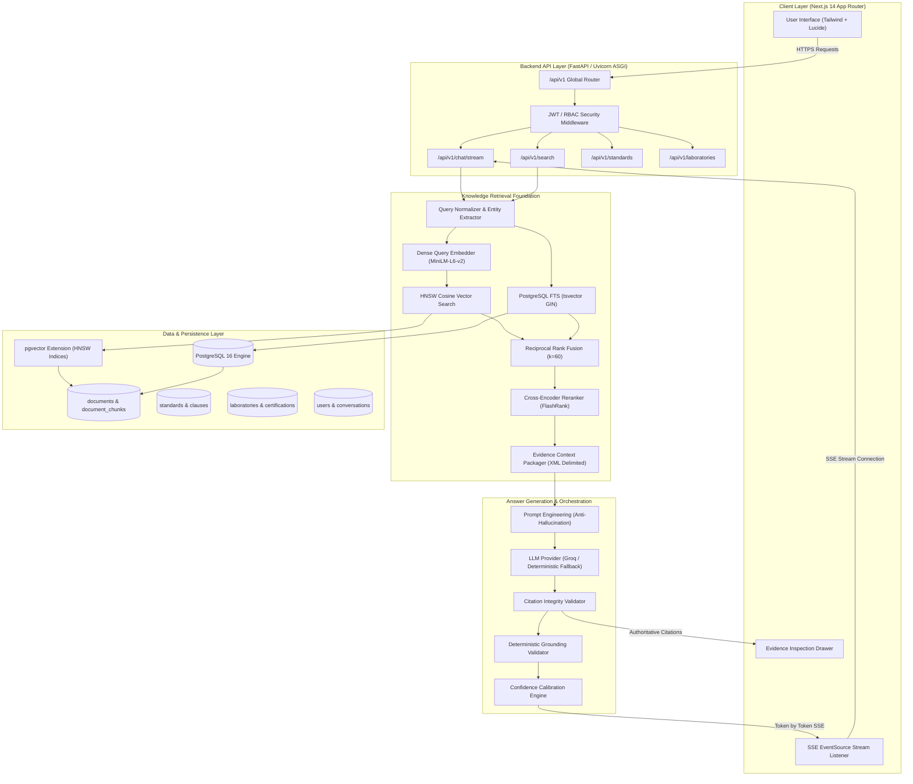
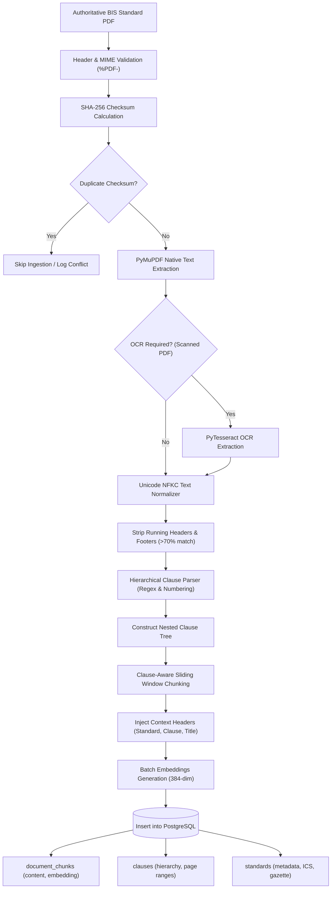
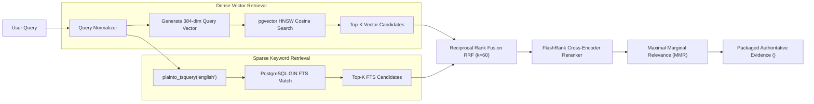
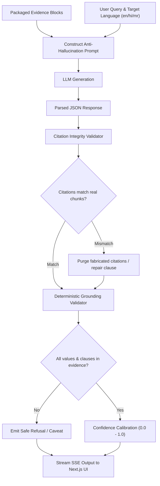
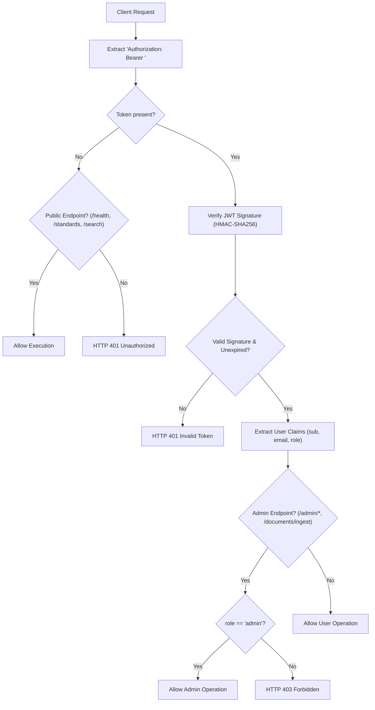
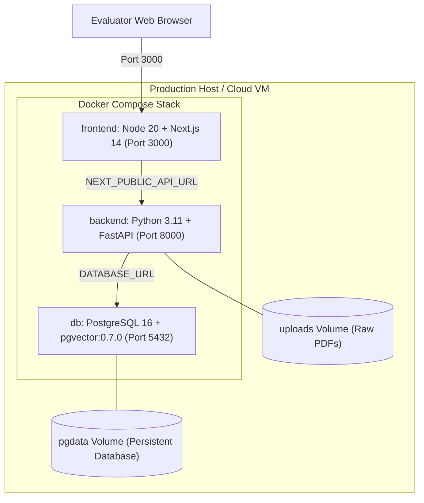
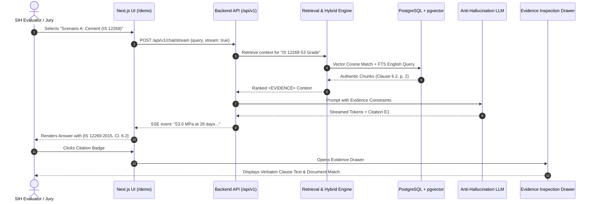

# BIS Quality / Compliance Copilot — Complete Architecture Specification

**Bureau of Indian Standards (BIS) AI Quality / Compliance Copilot**  
**Smart India Hackathon (SIH) Problem Statement:** 26107  
**Phase 8 Production Reference Architecture**

---

## 1. Overall System Architecture

---

## 2. Document Ingestion Pipeline

---

## 3. Hybrid RAG Retrieval Pipeline

---

## 4. Anti-Hallucination Generation Pipeline

---

## 5. Authentication & Role-Based Access Control (RBAC)

---

## 6. Containerized Deployment Architecture

---

## 7. SIH Evaluator Demonstration Flow

