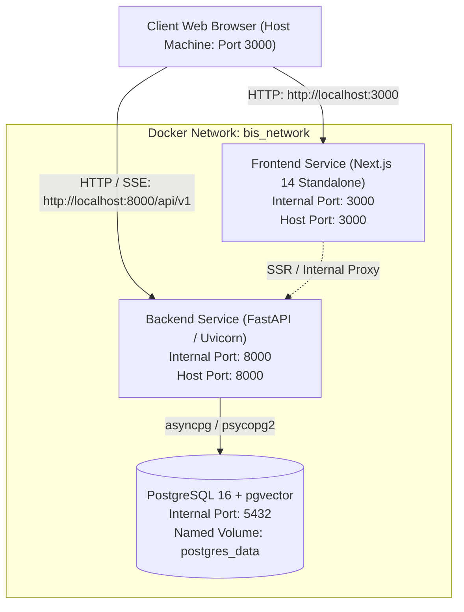

# Phase 7 Repository & Architecture Audit: Production Hardening & Deployment

**Project**: Bureau of Indian Standards (BIS) AI Compliance / Quality Copilot  
**Smart India Hackathon (SIH)** — Problem Statement: 26107  
**Date**: September 2026  
**Auditor**: Antigravity Autonomous Lead Architect  

---

## 1. Current Architecture (Phases 1–6)

The system currently comprises 6 completed layers:
1. **Phase 1 — Database & Schema Foundation**:
   - PostgreSQL 16 schema with `pgvector` (1536-dimensional HNSW cosine index `hnsw (embedding vector_cosine_ops)`).
   - PostgreSQL Full-Text Search (tsvector / GIN indexes on standard clauses, numbers, titles, and text).
   - Core relational models: `User`, `Document`, `Standard`, `Clause`, `DocumentChunk`, `Product`, `Laboratory`, `LaboratoryCapability`, `CertificationScheme`, `Conversation`, `Message`, `Citation`, `Feedback`.
   - Async session management with SQLAlchemy 2.0 (`asyncpg` for FastAPI runtime, `psycopg2` for Alembic/CLI sync operations).
2. **Phase 2 — Ingestion Pipeline**:
   - PDF extraction, OCR fallback, structural clause parsing (`5`, `5.1`, `Annex A`).
   - SHA-256 file checksum deduplication.
   - Deterministic and SentenceTransformer embedding generation.
3. **Phase 3 — Hybrid RAG Retrieval Engine**:
   - Dense vector retrieval (`<->` cosine distance via pgvector HNSW).
   - Sparse lexical retrieval (`to_tsquery` English/simple FTS).
   - Reciprocal Rank Fusion (RRF with $k=60$) combining vector and keyword scores.
   - Cross-encoder reranking (`BAAI/bge-reranker-v2-m3` or `NoOpReranker`).
   - Intra-document diversification and evidence traceability.
4. **Phase 4 — Grounded Answer Generation & Orchestration**:
   - Multi-tier LLM Provider (`DeterministicLLMProvider` for 100% offline reproducible CI/CD/demo, `OpenAICompatibleProvider` for cloud/local LLM backends).
   - Strict hallucination guard, citation validator, grounding score threshold ($0.60$).
   - Explicit refusal on out-of-domain/insufficient evidence.
   - Multilingual support preserving Latin standard codes (`IS 12269`, `Clause 6.2`) and units while generating fluent Hindi/Marathi/English answers.
5. **Phase 5 — Production Backend API Platform**:
   - FastAPI application rooted at `/api/v1`.
   - Security: JWT HS256 auth, bcrypt hashing, RBAC (`user`, `auditor`, `admin`).
   - Centralized error envelope: `{"success": false, "data": null, "error": {"code": "...", "message": "...", "request_id": "..."}, "meta": {"request_id": "..."}}`.
   - Endpoints: Auth, Standards, Clauses, Search, Laboratories, Certification, Chat, Streaming Chat (`/chat/stream`), Documents (Admin), Evaluation (Admin), Feedback, Health (`/health`, `/health/live`, `/health/ready`).
6. **Phase 6 — Next.js 14 Web Application**:
   - Next.js App Router (TypeScript, Tailwind CSS, Lucide icons).
   - Centralized typed API client (`frontend/lib/api/client.ts`) with SSE streaming parser, `X-Request-ID` tracing, JWT interception.
   - 18 statically compiled and pre-rendered routes.
   - Interactive SIH Evaluator Walkthrough (`/demo`).

---

## 2. Target Deployment Architecture

### Key Deployment Characteristics
- **Network Isolation**: All services communicate over the internal bridge network `bis_copilot_network`.
- **Database Non-exposure**: In production, PostgreSQL 5432 is restricted to the internal network; for dev/demo on host, mapped to `5432`.
- **Stateless Application Servers**: Backend and Frontend can be scaled horizontally without session loss (JWT state stored client-side; database stores conversation persistence).
- **Deterministic Startup Sequence**:
  1. PostgreSQL container starts & runs `pg_isready` healthcheck.
  2. Backend waits for PostgreSQL healthcheck `service_healthy`.
  3. Backend container startup script runs idempotent Alembic migrations (`alembic upgrade head`) and seeds demo data if uninitialized.
  4. Backend Uvicorn server boots on port 8000.
  5. Frontend waits for Backend healthcheck `/api/v1/health/live`.
  6. Frontend boots on port 3000.

---

## 3. Risks & Vulnerabilities Identified

1. **SPA Browser URL Resolution in Docker**:
   - *Risk*: In `docker-compose.yml`, `NEXT_PUBLIC_API_BASE_URL` was previously set to `http://backend:8000/api/v1`. Because the Next.js frontend code executes within the evaluator's browser on the host machine, client-side fetches to `backend:8000` fail with `ERR_NAME_NOT_RESOLVED`.
   - *Fix*: Default `NEXT_PUBLIC_API_BASE_URL` to `http://localhost:8000/api/v1` for browser consumption, or use Next.js internal API rewrites.
2. **Insecure JWT Secret in Production Mode**:
   - *Risk*: `JWT_SECRET_KEY` currently has a default fallback `"dev-insecure-jwt-secret-key-change-in-production-0123456789"`.
   - *Fix*: Enforce environment validation on application startup: when `ENVIRONMENT=production`, require `JWT_SECRET_KEY` to be at least 32 characters and NOT match the default dev secret.
3. **Root Health vs. Readiness Endpoint Separation**:
   - *Risk*: Currently `GET /health` in `main.py` checks the database. If DB is temporarily slow or restarting, process orchestrators might kill the container prematurely.
   - *Fix*: Decouple root `/health` (liveness probe: process is alive) from root `/ready` (readiness probe: database, pgvector, and models are available).
4. **SQLAlchemy Connection Pool Hardcoding**:
   - *Risk*: `pool_size` and `max_overflow` in `connection.py` were hardcoded (10 and 20), lacking configurable pool timeouts and recycle intervals for long-running deployments.
   - *Fix*: Expose `DB_POOL_SIZE`, `DB_MAX_OVERFLOW`, `DB_POOL_TIMEOUT`, and `DB_POOL_RECYCLE` in `Settings`.
5. **Magic Bytes Validation on Uploads**:
   - *Risk*: `DocumentService.process_upload` validated the `.pdf` extension and file size, but did not check initial byte signatures before file writes.
   - *Fix*: Enforce `%PDF-` magic header check (`b"%PDF-"`) to prevent masked malicious binaries from being stored.
6. **Request Structured Access Logging**:
   - *Risk*: `RequestContextMiddleware` extracted `X-Request-ID` and computed latency, but did not emit a structured JSON access log for each inbound request.
   - *Fix*: Emit single-line structured access logs containing `request_id`, `method`, `path`, `status_code`, `latency_ms`, and sanitized headers.
7. **Rate Limiting Configuration**:
   - *Risk*: `RATE_LIMIT_ENABLED` was disabled by default without configurable route overrides for expensive `/chat` and `/search` operations.
   - *Fix*: Provide configurable sliding-window rate limiting with clear HTTP 429 error responses including the active `request_id`.

---

## 4. Hardening Tasks

- [x] **Task 1: Repository Audit & Planning** (this document).
- [ ] **Task 2: Environment Configuration Hardening**:
  - Update `.env.example` with all configuration keys, documentation, and safe defaults.
  - Implement `validate_environment()` in `backend/app/config.py` enforcing production secret constraints.
- [ ] **Task 3: Backend Health & Readiness Decoupling**:
  - Expose lightweight `GET /health` (liveness) and structured `GET /ready` (readiness) at root and under `/api/v1`.
- [ ] **Task 4: Database Connection Pool & Resilience**:
  - Wire configurable connection pool settings (`DB_POOL_SIZE`, `DB_MAX_OVERFLOW`, `DB_POOL_TIMEOUT`, `DB_POOL_RECYCLE`, `DB_POOL_PRE_PING`).
- [ ] **Task 5: Structured Logging & Request Tracing**:
  - Update `RequestContextMiddleware` to log structured access entries.
  - Ensure sensitive headers (`Authorization`, passwords, API keys) are strictly sanitized.
- [ ] **Task 6: Document Ingestion Security**:
  - Add PDF magic bytes verification (`b"%PDF-"`) in `DocumentService.process_upload`.
  - Validate MIME types and reject corrupt/path-traversal file paths.
- [ ] **Task 7: Docker Compose & Containerization Hardening**:
  - Update `docker-compose.yml` with healthchecks, `depends_on: condition: service_healthy`, restart policies, and correct `NEXT_PUBLIC_API_BASE_URL`.
  - Create entrypoint script for backend container running migrations automatically.
- [ ] **Task 8: Demo Data Seeding Script**:
  - Create idempotent `scripts/seed_demo.py` seeding authentic Indian Standards (`IS 12269:2015 Clause 6.2`, `IS 1786:2008`, `IS 10500:2012`), products, and NABL labs.
- [ ] **Task 9: Automated Verification & Smoke Tests**:
  - Create `scripts/smoke_test.py` testing the complete 12-point deployment verification matrix.
  - Create `scripts/verify_deployment.py` testing database connectivity, pgvector, and migration status.
  - Create `scripts/benchmark_system.py` measuring latency percentiles (p50, p95).
  - Create `scripts/start_demo.py` single-command orchestrator.
- [ ] **Task 10: Operational Documentation**:
  - Author `docs/api-contract.md`.
  - Author `docs/backup-restore.md`.
  - Author `docs/deployment.md`.
  - Author `docs/demo-troubleshooting.md`.
  - Author `docs/security-checklist.md`.
  - Update `README.md` and `PROJECT_STATUS.md`.

---

## 5. File Modification Matrix

### Files Requiring Modifications
| File Path | Nature of Modification |
| :--- | :--- |
| [backend/app/config.py](file:///d:/sih107/backend/app/config.py) | Add connection pool settings, rate limit configs, startup environment validation. |
| [backend/app/main.py](file:///d:/sih107/backend/app/main.py) | Add root `/ready` endpoint; separate liveness `/health` from readiness `/ready`. |
| [backend/app/database/connection.py](file:///d:/sih107/backend/app/database/connection.py) | Pass configurable pool parameters into `create_async_engine` and `create_engine`. |
| [backend/app/api/middleware.py](file:///d:/sih107/backend/app/api/middleware.py) | Add access logging to `RequestContextMiddleware`, enforce security headers (`Referrer-Policy`). |
| [backend/app/services/document_service.py](file:///d:/sih107/backend/app/services/document_service.py) | Add PDF magic bytes verification (`%PDF-`), sanitize filenames. |
| [docker-compose.yml](file:///d:/sih107/docker-compose.yml) | Fix `NEXT_PUBLIC_API_BASE_URL`, healthcheck conditions, network definitions. |
| [.env.example](file:///d:/sih107/.env.example) | Add all production/deployment configuration keys with documentation. |
| [README.md](file:///d:/sih107/README.md) | Update with production deployment instructions and SIH quick-start. |
| [PROJECT_STATUS.md](file:///d:/sih107/PROJECT_STATUS.md) | Mark Phase 7 COMPLETE with full metrics and verification details. |

### Files That Must Remain Untouched
- All Phase 1 database models in `backend/app/models/*.py`.
- Alembic migration `backend/alembic/versions/0001_initial_schema.py`.
- Core RAG algorithms: `backend/app/retrieval/hybrid.py`, `backend/app/retrieval/vector_search.py`, `backend/app/retrieval/keyword_search.py`.
- Core Generation logic: `backend/app/generation/orchestration.py`, `backend/app/generation/citation_validator.py`.
- Existing backend test suite: `backend/tests/**/*.py` (all 149 tests must remain 100% passing).
- Frontend design and user interface routes in `frontend/app/**/*.tsx`.

---

## 6. Test & Verification Strategy

1. **Unit & Integration Regression (Pytest)**:
   - Execute all 149 backend tests (`pytest -q`) to guarantee zero regression across Phases 1–5.
2. **Frontend Test Suite (Vitest)**:
   - Execute all 8 Vitest unit tests in `frontend/` (`npm test`).
3. **Frontend Linting & Production Build**:
   - Run `npm run lint` and `npm run build` to guarantee 0 TypeScript/ESLint errors and successful SSG pre-rendering of all 18 routes.
4. **Automated Smoke Test (`scripts/smoke_test.py`)**:
   - Verify health, readiness, authentication, chat streaming, citations, refusal behavior, and multilingual responses against the active backend.
5. **Alembic Verification (`alembic heads`)**:
   - Verify database migrations are aligned with head (`0001_initial_schema`).
6. **Live Infrastructure Reporting**:
   - Accurately report Docker availability on the host system without fabricating output.
