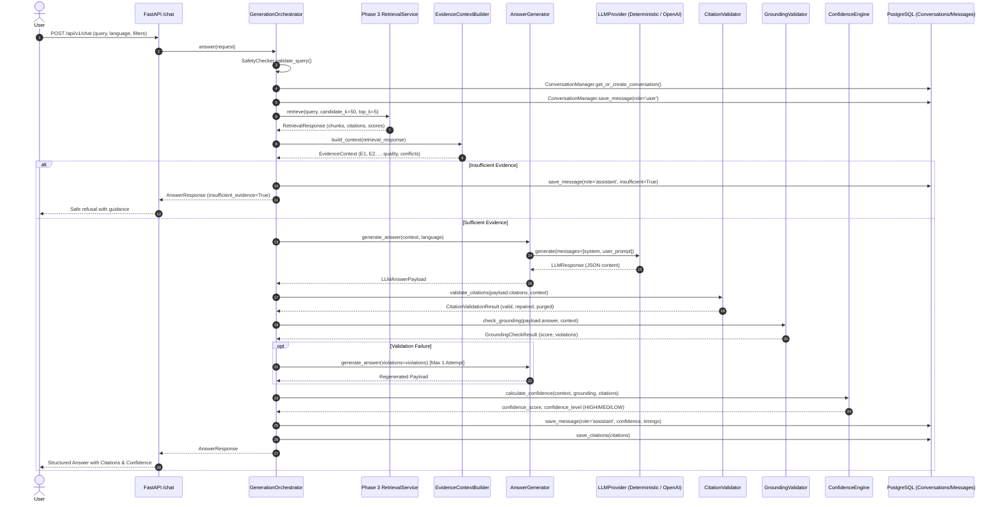

# BIS Copilot — Phase 4: RAG Answer Generation / AI Orchestration

## 1. Overview & Anti-Hallucination Philosophy
Phase 4 delivers the production-quality **RAG Answer Generation and AI Orchestration** layer for the BIS Copilot system (SIH Problem Statement 26107). It integrates the relational database foundation (Phase 1), the document ingestion pipeline (Phase 2), and the hybrid retrieval engine (Phase 3) into an end-to-end question-answering assistant for Indian Standards and Bureau of Indian Standards (BIS) services.

### Core Non-Negotiable Axiom
> [!IMPORTANT]
> **The LLM is a language generator, NOT the source of truth.**
> All factual claims, numerical limits, test methods, clause numbers, and standard numbers must originate strictly from retrieved authoritative database chunks. If evidence is insufficient, conflicting, or weak, the system explicitly refuses to extrapolate and safely informs the user.

---

## 2. End-to-End Orchestration Architecture



---

## 3. Core Components

### 3.1 LLM Provider Abstraction (`backend/app/generation/provider.py`, `llm_provider.py`)
Provides a vendor-agnostic interface:
- `LLMProvider(ABC)`: Asynchronous `generate(...)` and `stream_generate(...)` methods returning `LLMResponse`.
- `DeterministicLLMProvider`: 100% offline, zero-cost deterministic synthesis used for unit tests, offline development, and zero-key deployments.
- `OpenAICompatibleProvider`: Async client using `httpx` supporting OpenAI, vLLM, Ollama, Groq, and Mistral with retries, timeouts, and JSON mode.

### 3.2 Evidence Context Builder (`backend/app/generation/context.py`)
Transforms Phase 3 retrieval results into a clean, delimited prompt structure:
- Applies `GENERATION_MAX_CONTEXT_CHUNKS` (default: 5) and `GENERATION_MIN_RELEVANCE_SCORE` (default: 0.20).
- Assigns deterministic prompt tokens: `E1`, `E2`, `E3`...
- Detects version conflicts across standard editions (e.g. `IS 1293:2005` vs `IS 1293:2019`).
- Evaluates context quality (`GOOD`, `WEAK`, `INSUFFICIENT`).

### 3.3 Anti-Hallucination Prompt Architecture (`backend/app/generation/prompts.py`)
- Delimited evidence framing:
  ```xml
  <EVIDENCE id="E1">
  Standard: IS 99999:2025
  Clause: 5.2 (Mechanical Performance)
  Pages: 5–6
  Citation: [IS 99999:2025, Clause 5.2, pp. 5–6]
  Content:
  Breaking load must withstand a minimum force of 450 N at 25°C.
  </EVIDENCE>
  ```
- Strict JSON output schema requiring `answer`, `confidence`, `evidence_used`, `citations`, `caveats`, and `insufficient_evidence`.
- Multilingual instructions allowing narrative translation into Hindi (`hi`) or Marathi (`mr`) while locking standard numbers, clause numbers, and units into Latin/English notations.

### 3.4 Citation Validation & Repair (`backend/app/generation/citation_validator.py`)
- Verifies every generated citation against the genuine `EvidenceItem` referenced by `evidence_id`.
- Replaces hallucinatory citations with authentic database attributes.
- Purges fabricated citations referencing non-existent evidence IDs.

### 3.5 Grounding Verification (`backend/app/generation/grounding.py`)
Deterministic checks verify:
1. All standard numbers in the answer exist in the evidence.
2. All clause identifiers exist in the evidence.
3. All significant numerical values (e.g. `450`, `2500`) exist in the source chunks.
4. Mandatory language (`shall`, `must`) in the answer is backed by prescriptive evidence.
5. Computes a quantitative `grounding_score` ($0.0 - 1.0$).

### 3.6 Multi-Factor Confidence Engine (`backend/app/generation/confidence.py`)
Calculates confidence from five transparent signals:
$$\text{Confidence} = 0.30 \cdot \text{RetrievalQuality} + 0.30 \cdot \text{GroundingScore} + 0.20 \cdot \text{CitationValidity} + 0.10 \cdot \text{EvidenceCoverage} - \text{ConflictPenalty}$$
- Categorized into: `HIGH` ($\ge 0.75$), `MEDIUM` ($\ge 0.50$), `LOW` ($\ge 0.40$), and `INSUFFICIENT` ($< 0.40$).

### 3.7 Conversation & Citation Persistence (`backend/app/generation/conversation.py`)
Seamlessly integrates with the existing Phase 1 database models:
- `conversations`: Stores conversation title, user ID, language.
- `messages`: Records role (`user`, `assistant`), content, intent, calibrated confidence, latency.
- `citations`: Records linked standard ID, document ID, clause ID, chunk ID, page number, citation text, and relevance score.
- `feedback`: Records user rating ($1$ or $-1$) and correction commentary.

---

## 4. Configuration & Environment Variables

| Variable | Default | Description |
| :--- | :--- | :--- |
| `LLM_PROVIDER` | `deterministic` | Provider implementation (`deterministic`, `openai`) |
| `LLM_MODEL` | `gpt-4o-mini` | Pretrained model identifier |
| `LLM_API_KEY` | None | API secret key for remote provider |
| `LLM_BASE_URL` | None | Base URL for OpenAI-compatible proxies |
| `LLM_TEMPERATURE` | `0.0` | Sampling temperature for strict determinism |
| `LLM_MAX_TOKENS` | `1500` | Max tokens generated per completion |
| `LLM_TIMEOUT_SECONDS` | `30` | Request timeout bound |
| `GENERATION_MAX_CONTEXT_CHUNKS` | `5` | Maximum evidence items passed to model |
| `GENERATION_MIN_RELEVANCE_SCORE` | `0.20` | Relevance cutoff for prompt inclusion |
| `GENERATION_MIN_GROUNDING_SCORE` | `0.60` | Minimum grounding score to pass verification |
| `REFUSE_ON_INSUFFICIENT_EVIDENCE`| `true` | Safely refuses when evidence is inadequate |
| `ENABLE_STREAMING` | `true` | Enables Server-Sent Events (SSE) streaming |

---

## 5. API Endpoints

### 5.1 Chat Answering (`POST /api/v1/chat`)
**Request:**
```json
{
  "query": "What is the breaking load requirement in IS 99999 clause 5.2?",
  "language": "en",
  "filters": {
    "standard_number": "IS 99999",
    "clause_number": "5.2"
  }
}
```

**Response:**
```json
{
  "conversation_id": "8f39a04a-4d76-4d2c-8a21-7299a9b69101",
  "message_id": "4e7195d2-9721-4f11-8a9d-5bc77b941589",
  "answer": "According to IS 99999:2025, Clause 5.2: Breaking load shall withstand a minimum force of 450 N at 25°C. Requirements must be verified against the official standard document.",
  "confidence": 0.92,
  "confidence_level": "HIGH",
  "citations": [
    {
      "standard": "IS 99999:2025",
      "clause": "5.2",
      "pages": "pp. 5–6",
      "citation_text": "[IS 99999:2025, Clause 5.2, pp. 5–6]"
    }
  ],
  "intent": "requirement_question",
  "insufficient_evidence": false,
  "caveats": ["Answer grounded strictly in verified database chunks."],
  "follow_up_questions": [
    "What are the test methods for IS 99999:2025?",
    "Which laboratories are recognized for this certification?"
  ],
  "processing": {
    "retrieval_ms": 14.5,
    "context_ms": 1.2,
    "generation_ms": 5.4,
    "validation_ms": 2.1,
    "persistence_ms": 3.0,
    "total_ms": 26.2
  },
  "provider": "deterministic",
  "model": "deterministic-engine-v1"
}
```

### 5.2 Streaming (`POST /api/v1/chat/stream`)
Emits SSE events:
- `event: token`: `{"chunk": "According"}`
- `event: final`: Full verified `AnswerResponse` JSON once grounding and citation validations pass.

### 5.3 Health Check (`GET /api/v1/health/details`)
Reports subsystem health across database, retrieval, and generation services.

---

## 6. Testing Strategy & Results
- **Phase 1 Regression**: 14 passed (schema, indexes, constraints).
- **Phase 2 Regression**: 25 passed (ingestion, chunking, OCR, parser, embeddings).
- **Phase 3 Regression**: 41 passed (retrieval, hybrid fusion, reranker, diversification).
- **Phase 4 Tests**: 38 passed (prompts, providers, grounding, citation repair, confidence, API endpoints).
- **Overall**: 118 passed, 5 skipped (clean offline DB skip) in 28.81s.
