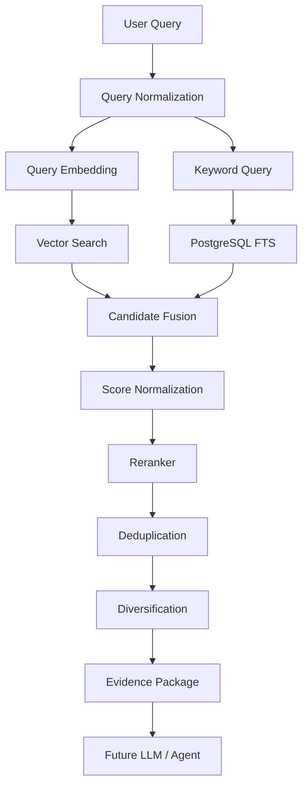

# BIS Copilot — Phase 3: Knowledge / RAG Retrieval Foundation

## 1. Overview & Core Philosophy
Phase 3 implements the **Knowledge / RAG Retrieval Foundation** for BIS Copilot (SIH Problem Statement 26107). It bridges the authoritative documents and structured clauses ingested in Phase 2 with future AI reasoning agents in Phase 4/5.

### Core Principles
* **Authoritative & Traceable**: Every result links directly to a genuine database chunk (`document_chunks.id`), retaining its source document, standard, clause, and original page coordinates.
* **Deterministic & Explainable**: Scoring formulas, fusion algorithms, and tie-breakers are transparent, reproducible, and recorded per candidate.
* **No Hallucination**: The retrieval engine never invents text, creates phantom standard numbers, or hallucinates page citations. It returns only verified source content.
* **Resilient**: Gracefully falls back if one retrieval modality or the optional cross-encoder reranker experiences transient failures.

---

## 2. Retrieval Pipeline Architecture



---

## 3. Component Details

### 3.1 Query Processing (`backend/app/retrieval/query.py`)
- **Unicode NFKC Normalization**: Cleans irregular characters and ligatures.
- **Whitespace Collapsing**: Removes erratic linebreaks and tabs while preserving whitespace boundaries.
- **Identifier Preservation**: Protects Indian Standard notations (e.g. `IS 1293:2019`, `IS/IEC 60065`), clause numbers (`5.2`, `7.3.1`, `Annex A`), and physical units (`kV`, `MPa`, `mm`, `°C`).
- **Validation**: Enforces non-empty string constraints (1 to 2000 characters) and raises structured `QueryValidationError`.
- **Heuristic Intent Classification**: Classifies queries deterministically into intents (`standard_lookup`, `clause_lookup`, `test_method`, `certification`, `laboratory`, `requirement_question`, `general`) without invoking an LLM.

### 3.2 Vector Search (`backend/app/retrieval/vector_search.py`)
- **pgvector Integration**: Executes semantic nearest-neighbor search using the `<=>` cosine distance operator against `document_chunks.embedding`.
- **HNSW Index Optimization**: Targets the `ix_document_chunks_embedding_hnsw` index (`m=16, ef_construction=64, vector_cosine_ops`) defined in Phase 1.
- **Score Calibration**: Converts raw cosine distance $d \in [0, 2]$ to similarity score:
  $$\text{similarity} = \max(0.0, \min(1.0, 1.0 - d))$$

### 3.3 Keyword Search (`backend/app/retrieval/keyword_search.py`)
- **PostgreSQL Full-Text Search**: Uses `document_chunks.search_vector` with the `ix_document_chunks_search_vector_gin` index.
- **Natural Language Parsing**: Employs `websearch_to_tsquery('english', query)` for tolerant search query syntax (handling unquoted phrases and negation).
- **Cover Density Ranking (`ts_rank_cd`)**: Measures proximity between query terms in the text passage, prioritizing tight clause matches over scattered term occurrences.
- **Technical Identifier Boosting**: Detects standard numbers or clause patterns in the query and adds deterministic rank boosts ($+0.25$) when exact metadata matches occur.

### 3.4 Candidate Fusion (`backend/app/retrieval/hybrid.py`)
Candidates retrieved from vector search and keyword search are merged and scored using one of two strategies:
1. **Weighted Score Fusion (Default)**:
   - Normalizes vector scores and keyword scores into $[0.0, 1.0]$ via min-max scaling.
   - Combines scores linearly using configurable weights:
     $$\text{fused\_score} = (w_{\text{vec}} \times \text{norm\_vec}) + (w_{\text{kw}} \times \text{norm\_kw})$$
     *(Defaults: $w_{\text{vec}} = 0.6$, $w_{\text{kw}} = 0.4$)*
2. **Reciprocal Rank Fusion (RRF)**:
   - Rank-based fusion invariant to raw score calibrations:
     $$\text{RRF}(d) = \sum_{m \in \{\text{vector}, \text{keyword}\}} \frac{1}{k + \text{rank}_m(d)} \quad (k = 60)$$

### 3.5 Reranking (`backend/app/retrieval/reranker.py`)
- **Abstract Interface**: `Reranker.rerank(query, candidates, top_k)`.
- **`NoOpReranker`**: High-speed pass-through maintaining fused scores; used in offline CI/CD, unit tests, or when reranking is disabled.
- **`CrossEncoderReranker`**: Deep cross-encoder model (e.g. `BAAI/bge-reranker-v2-m3` or `BAAI/bge-reranker-base`).
- **Resilience**: If the neural model fails or dependencies are absent, it automatically logs a warning and falls back to hybrid fused rankings without raising an unhandled exception.

### 3.6 Deduplication & Diversification (`backend/app/retrieval/diversification.py`)
- **Deduplication**: Chunks appearing across both vector and keyword searches are unified under their unique `chunk_id`, combining their relevance evidence.
- **Clause Flood Mitigation**: Ensures variety by limiting initial selection to `MAX_CHUNKS_PER_CLAUSE` (default 3) per clause. Any remaining result slots are backfilled from next-best candidates.

### 3.7 Citations & Evidence (`backend/app/retrieval/citations.py`, `evidence.py`)
- **Authoritative Citation String**: Formatted deterministically:
  `[IS 1293:2019, Clause 5.2, pp. 14–15]` or `[IS 99999:2025, Annex A, p. 22]`
- **Evidence Data Contract**: Contains `chunk_id`, `document_id`, `standard_number`, `clause_number`, `heading`, `page_start`, `page_end`, `content`, and `relevance_score`.
- **LLM Context Serialization**: `EvidencePackager.to_llm_context_dict()` provides structured context ready for Phase 4 prompts.

---

## 4. Configuration & Environment Variables

| Variable | Default | Description |
| :--- | :--- | :--- |
| `RETRIEVAL_METHOD` | `hybrid` | Default search modality (`hybrid`, `vector`, `keyword`) |
| `VECTOR_TOP_K` | `50` | Candidate pool size for pgvector cosine search |
| `KEYWORD_TOP_K` | `50` | Candidate pool size for PostgreSQL full-text search |
| `FINAL_TOP_K` | `10` | Final evidence chunks returned |
| `VECTOR_WEIGHT` | `0.6` | Weight assigned to vector similarity during fusion |
| `KEYWORD_WEIGHT` | `0.4` | Weight assigned to full-text search during fusion |
| `RRF_K` | `60` | Constant denominator used in Reciprocal Rank Fusion |
| `RERANKER_ENABLED` | `true` | Enables cross-encoder reranking |
| `RERANKER_MODEL` | `BAAI/bge-reranker-v2-m3` | Pretrained cross-encoder model identifier |
| `RERANKER_TOP_K` | `20` | Maximum candidate count passed to cross-encoder |
| `MAX_CHUNKS_PER_CLAUSE` | `3` | Maximum chunks from the same clause in diversified output |
| `LOW_CONFIDENCE_THRESHOLD`| `0.25` | Score threshold below which response is marked `LOW_CONFIDENCE` |

---

## 5. CLI Tools & Evaluation Scripts

### 5.1 Interactive Retrieval CLI (`scripts/test_retrieval.py`)
Execute a search query from the command line:
```bash
python scripts/test_retrieval.py --query "What are the material requirements in IS 99999 clause 5.2?" --dry-run --debug
```

Supported flags:
* `--query`, `-q`: Search query string
* `--method`, `-m`: Search method (`hybrid`, `vector`, `keyword`)
* `--standard`, `-s`: Filter by standard number (e.g. `IS 99999`)
* `--clause`, `-c`: Filter by clause number (e.g. `5.2`)
* `--top-k`, `-k`: Result limit
* `--no-rerank`: Bypass cross-encoder reranking
* `--dry-run`: Execute with synthetic fixtures if database is offline
* `--debug`: Output latency and candidate diagnostics

### 5.2 Retrieval Evaluation Benchmark (`scripts/benchmark_retrieval.py`)
Evaluates retrieval accuracy across ground-truth questions:
```bash
python scripts/benchmark_retrieval.py
```

Measures:
* **Recall@5 & Recall@10**: Proportion of relevant expected chunks successfully retrieved in top 5 / top 10.
* **MRR (Mean Reciprocal Rank)**: Quality of top-1 ranking position across the benchmark set.
* **Latency**: End-to-end execution duration (min, max, average) in milliseconds.

---

## 6. Testing Strategy
- **Unit & Scoring Tests** (`backend/tests/retrieval/`):
  - `test_query.py`: Whitespace cleaning, Unicode handling, identifier protection, and intent classification.
  - `test_filters.py`: Relational WHERE clauses for standards, clauses, documents, and active status.
  - `test_scoring.py`: Cosine distance conversion, min-max normalization, rank normalization, deterministic tie-breakers.
  - `test_hybrid.py`: Weighted fusion and RRF fusion accuracy.
  - `test_reranker.py`: `NoOpReranker` pass-through and graceful cross-encoder fallback.
  - `test_diversification.py`: Chunk deduplication and clause flood limiting.
  - `test_citations.py`: Verifiable citation formatting and page reference handling.
  - `test_evidence.py`: Evidence serialization and score propagation.
  - `test_service.py`: Service orchestration, partial failure fallbacks, low confidence detection.
- **Integration Tests**:
  - `test_vector_search.py` & `test_keyword_search.py`: Verify pgvector `<=>` and FTS `@@` compilation; execute against live database when reachable or skip cleanly when offline.
